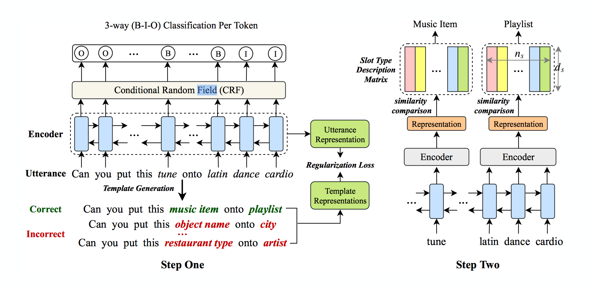

# [Coach: A Coarse-to-Fine Approach for Cross-domain Slot Filling](http://arxiv.org/abs/2004.11727)

[TOC]

## Abstract

- Proposed method: Coarse-to-fine approach
- cross-domain slot filling method
- joint method: 
  - step one: learns the general pattern of slot entities
  - step two: predict the specific types for the slot entities
- template regularization approach to improve the adaptation robustness 
- the official repo: https://github.com/zliucr/coach

## Model

Below is the whole model structure :

## ideas

### whole slot entities

shared parameters can enhance the slot entity recongnization, which doesn't contains slot type. It can learn the slot entity pattern which is important for cross-domain task.

> BIO slot prediction is simple

### slot type description

There is a matrix which stores the slot description using similarity function to compute slot type score.

### template regularization

Example template can delexical slot entity tokens in utterance. And product both correct and incorrect template. By doing so, the model can learn to cluster the representation of semantically utterance into a similar vector space.

## Details

### slot entity pattern

$$
\begin{array}{c}
{\left[h_{1}, h_{2}, \ldots, h_{n}\right]=\operatorname{BiL} \operatorname{STM}(\mathbf{E}(\mathbf{w}))} \\
{\left[p_{1}, p_{2}, \ldots, p_{n}\right]=\operatorname{CRF}\left(\left[h_{1}, h_{2}, \ldots, h_{n}\right]\right)}
\end{array}
$$

$p_i$ is the 3-way classification. 

### slot description

$$
\begin{array}{c}
r_{k}=\operatorname{BiL} \operatorname{STM}\left(\left[h_{i}, h_{i+1}, \ldots h_{j}\right]\right) \\
s_{k}=M_{\text {desc}} \cdot r_{k}
\end{array}
$$

- $n_s$ is the possible of all token type. 
- $d_s$ is the dimension of slot description. 
- $r_k \in R^{d_s}$ denotes the representation of the $k^{th}$ slot entity by summing the embedding of N slot description tokens.

$$
r^{d e s c}=\sum_{i=1}^{N} \mathbf{E}\left(t_{i}\right)
$$

- $M_{desc}\in R^{n_s \times d_s}$ is the representation matrix of the slot description. 
- $s_k \in R^{n_s}$ is the specific slot type prediction.

### template regularization

: to improve the adaptation ability.

**how to generate template examples ?**

replace the slot entity in the utterance with different slot labels to generate correct and incorrect utterance templates. 

To generate the wrong template, we replace the correct slot entity with another random slot entity.

**use BiLSTM and attention to generate utterance and template representation** 

$$
e_{t}=h_{t} w_{a}
$$

$$
\alpha_{t}=\frac{\exp \left(e_{t}\right)}{\sum_{j=1}^{n} \exp \left(e_{j}\right)}
$$

$$
\quad R=\sum_{t=1}^{n} \alpha_{t} h_{t}
$$

- $h_t$ is the output of the BiLSTM $t^{th}$ step
- $w_a$ is the weight vector in attention layer
- $R$ is the representation for input utterance or template

**loss function**

compute the right and wrong templates, which can be formulated as follows:

$$
\begin{array}{c}
L^{r}=\operatorname{MSE}\left(R^{u}, R^{r}\right) \\
L^{w}=-\beta \times \operatorname{MSE}\left(R^{u}, R^{w}\right)
\end{array}
$$

- $R^u$ is the representation of the user utterance.
- $R^r$ is the representation of the right template 
- $R^w$ is the representation of the wrong template 

So, model can minimize the distance between $R^u$ and $R^r$. Model can maxmize the distance between $R^u$ and $R^w$.